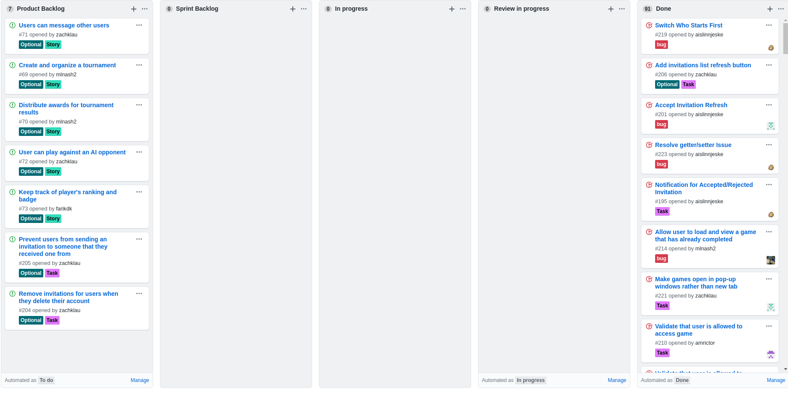
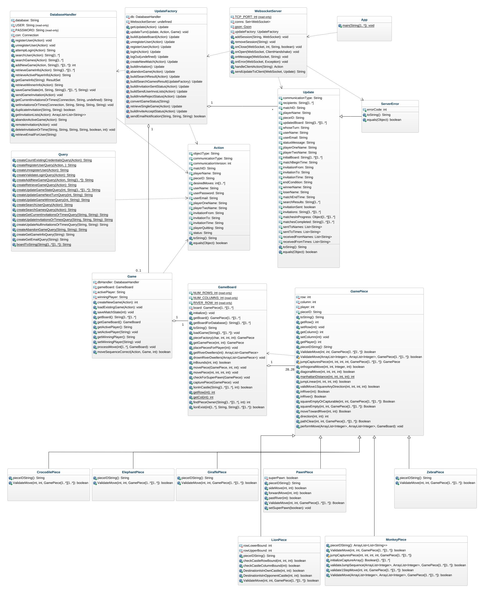

# P3 Deliverables for ByteMechanics

## User Stories and Tasks
The user stories and tasks can be found on GitHub

## Kanban Board

## Design Artifacts

The source file for our CRC cards can be found [here](https://docs.google.com/document/d/1QvapYqn3FcKuRy45nCooyzQOYaSvrWr5oXBb_wnxAsA/edit?usp=sharing)

## Source Code
The source code can be found on GitHub

## Traceability Link Matrix

The source file for our traceability matrix can be found [here](https://docs.google.com/spreadsheets/d/1Z-q8Ewaee5ntxZo9_I-F8YJsoha9UekDGaGTfl8_X9k/edit?usp=sharing)

## Retrospective/Lessons Learned
- What did we do well?
  - Used the Kanban board to more equitably and efficiently assign tasks.
  - Communication across the group was clear and prompt.
  - Better focus on the high priority items.  
  - Broaden everybody responsibilities within the code base to give them more exposure to different features, languages, tools, etc.
  - Start early and spread out the delivery of our tasks.
- What should we have started doing in order to improve?
  - There’s still room for improvement in spreading out the work.
  - Also we could have better understood the blockages and schedule dependencies on others when assigning tasks.
  - Could meet with the product owner more often to make sure we’re delivering the product correctly but scheduling in academia is difficult.
  - Better planning to provide clarity and consistency on our communication formats between client and server.
- What did we learn?  
  - How to start a new project from a high level specification.  
  - How to research and select techniques, languages and tools to use to complete the project.
  - How to work and negotiate with others to arrive at a consensus.

## Presentation
Presentation slides can be found in the P3Deliverables folder on GitHub
